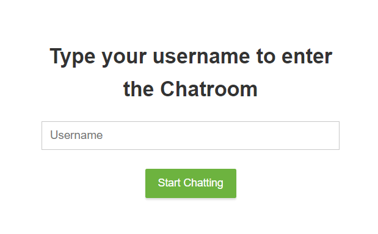
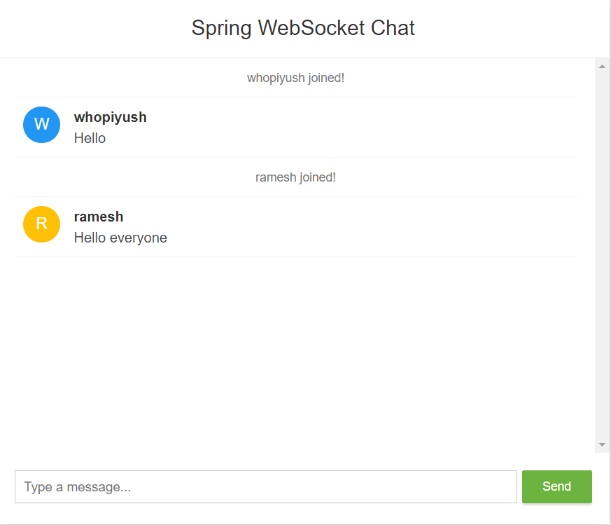

<h1>SPRINGCHAT - Spring Boot Chat Application with WebSocket</h1>

  
  

<h2>Overview</h2>

This project is a chat application built using Spring Boot and WebSocket. It allows real-time communication between clients and the server.

Chat Room -

  

<h2>Dependencies Used</h2>
<ul>
  <li>Lombok</li>
  <li>WebSocket</li>
  <li>Spring Web</li>
</ul>

<h2>WebSocket</h2>

WebSocket is a communication protocol that provides full-duplex communication channels over a single TCP connection. It offers several advantages over traditional HTTP communication:

<h3>Advantages of WebSocket</h3>
<ol>
  <li><strong>Real-time Data Transfer:</strong> WebSocket enables real-time data transfer between clients and servers.</li>
  <li><strong>Bi-Directional Communication:</strong> Unlike HTTP, WebSocket allows communication to be initiated by both clients and servers.</li>
  <li><strong>Efficiency:</strong> WebSocket doesn't require headers for every message, making it more efficient than HTTP.</li>
  <li><strong>Persistent Connection:</strong> WebSocket maintains a persistent connection between the client and server, reducing latency in data transfer.</li>
</ol>

<h3>Use Cases for WebSocket</h3>
<ol>
  <li><strong>Chat Application:</strong> WebSocket is ideal for building real-time chat applications.</li>
  <li><strong>Real-time Gaming:</strong> It can be used for real-time multiplayer gaming.</li>
  <li><strong>Collaborative Editing:</strong> WebSocket facilitates real-time collaboration in editing documents or code.</li>
  <li><strong>Live Updates:</strong> Websites or applications requiring live updates benefit from WebSocket.</li>
  <li><strong>Internet of Things (IoT):</strong> WebSocket allows IoT devices to send real-time updates to servers, which can then push these updates to end-users.</li>
</ol>

Live chat -

  

<h2>Usage</h2>

Provide instructions on how to run or deploy your Spring Boot application here.

<h2>Configuration</h2>

Include any specific configuration settings or requirements for your application.

<h2>Contributing</h2>

If you'd like to contribute to this project, please follow the standard guidelines for contributing.

